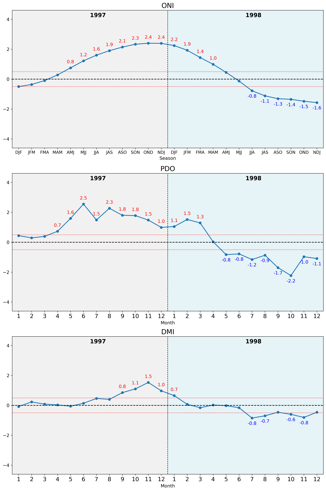
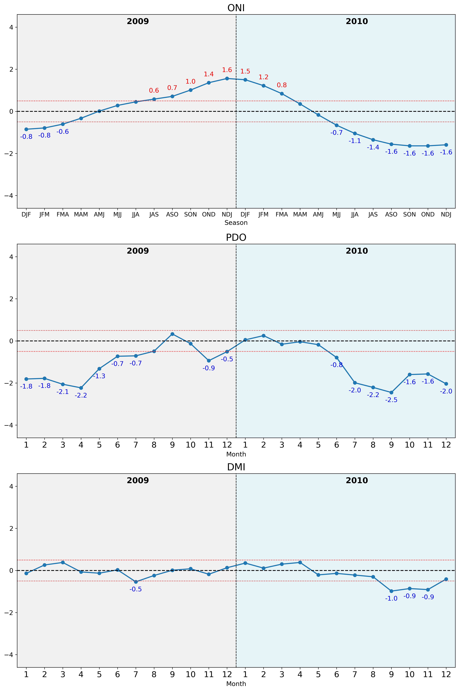
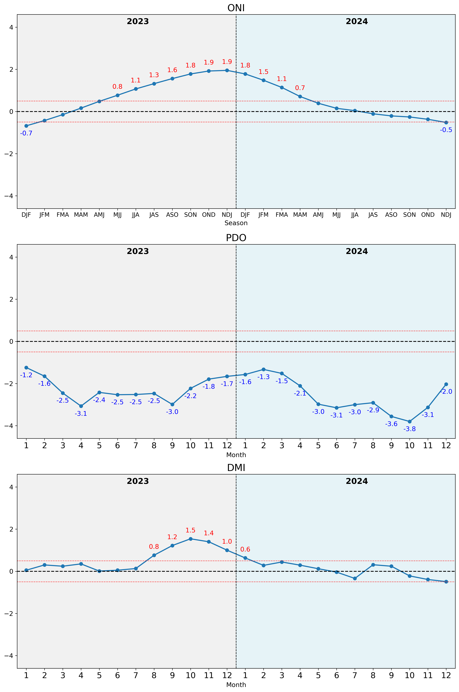

# Climate Indices Visualization Project

A comprehensive data visualization tool for analyzing climate indices using real-time data from NOAA sources. This project visualizes three major climate indices: Pacific Decadal Oscillation (PDO), Oceanic Niño Index (ONI), and Dipole Mode Index (DMI).

## 🌊 **Features**

- **Real-time Data Integration**: Automatically fetches the latest climate data from NOAA sources
- **Multi-Index Visualization**: Displays PDO, ONI, and DMI indices in synchronized plots
- **Batch Processing**: Generates visualizations for multiple years automatically
- **Professional Visualizations**: High-quality, publication-ready charts
- **Comprehensive Analysis**: 24-month time series with previous and current year data

## 📊 **Climate Indices Explained**

- **PDO (Pacific Decadal Oscillation)**: Long-term climate pattern affecting North Pacific sea surface temperatures
- **ONI (Oceanic Niño Index)**: Primary indicator for El Niño and La Niña events
- **DMI (Dipole Mode Index)**: Measures the Indian Ocean Dipole, affecting weather patterns across the Indo-Pacific

## 🚀 **Quick Start**

### Prerequisites
```bash
pip install -r requirements.txt
```

### Running the Analysis
```bash
jupyter notebook climate_indices_visualization.ipynb
```

Or use any Jupyter-compatible environment like VS Code, JupyterLab, or Google Colab.

## 📁 **Project Structure**

```
climate_indices_visualization/
├── climate_indices_visualization.ipynb  # Main analysis notebook
├── requirements.txt                     # Python dependencies
├── sample_images/                      # Sample visualizations for README
│   ├── sample_1998.png                 # El Niño year example
│   ├── sample_2010.png                 # La Niña year example
│   └── sample_2024.png                 # Recent data example
├── LICENSE                             # MIT License
└── README.md                           # Project documentation
```

## 🔄 **Data Sources**

This project uses official NOAA data sources:

- **PDO**: [NOAA ERSST v5 PDO Data](https://www.ncei.noaa.gov/pub/data/cmb/ersst/v5/index/ersst.v5.pdo.dat)
- **ONI**: [NOAA Climate Prediction Center ONI](https://www.cpc.ncep.noaa.gov/data/indices/oni.ascii.txt)
- **DMI**: [NOAA ERSST v5 IOD Data](https://www.ncei.noaa.gov/pub/data/cmb/ersst/v5/index/ersst.v5.iod.dat)

## 📈 **Sample Visualizations**

The project generates comprehensive visualizations showing 24-month time series with standardized formatting, color-coded extreme values, and clear temporal separation. Here are examples from different climate periods:

### 1998 - El Niño Year

*Strong El Niño event showing positive ONI values and corresponding climate patterns*

### 2010 - La Niña Year  

*La Niña conditions with negative ONI values and contrasting patterns*

### 2024 - Recent Data

*Latest available data demonstrating real-time capabilities*

**Key Features Shown:**
- 24-month time series (previous year + current year)
- Standardized y-axis ranges for easy comparison
- Color-coded extreme value annotations (red >0.5, blue <-0.5)
- Clear temporal separation between years
- Professional scientific visualization standards

## 🛠 **Technical Features**

- **Robust Data Parsing**: Handles various NOAA data formats with real-time web scraping
- **Missing Data Management**: Graceful handling of incomplete datasets and future data points
- **Dynamic Scaling**: Automatic y-axis adjustment based on data ranges across all indices
- **Batch Processing**: Generates 75+ years of visualizations efficiently
- **Memory Optimization**: Efficient processing of large datasets with proper cleanup
- **Consistent Formatting**: Standardized visualization style across all time periods

## 📋 **Usage Examples**

### Generate Visualizations
```python
# Run all cells in the notebook to:
# 1. Load real-time data from NOAA sources
# 2. Process and clean the data
# 3. Generate visualizations for all available years
# Output will be saved as PNG files in the 'output' directory
```

### Key Outputs
- Individual year visualizations (e.g., `1951.png`, `2024.png`)
- Combined 3-panel plots showing ONI, PDO, and DMI
- 24-month time series (previous year + current year)

## 🤝 **Contributing**

Contributions are welcome! Please feel free to submit a Pull Request.

## 📄 **License**

This project is open source and available under the [MIT License](LICENSE).

## 🏆 **About**

This project demonstrates advanced data science capabilities including:
- Real-time data integration from web APIs
- Time series data processing and visualization
- Interactive dashboard development
- Automated batch processing
- Professional data presentation

Perfect for climate research, educational purposes, or as a portfolio demonstration of data science skills.

---

**Author**: [Pongsakorn Onnim]  
**Contact**: [pongsakorn.onnnim@gmail.com]  
